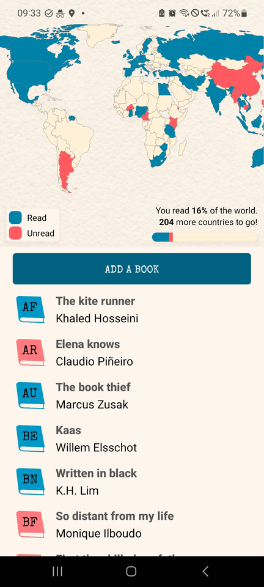
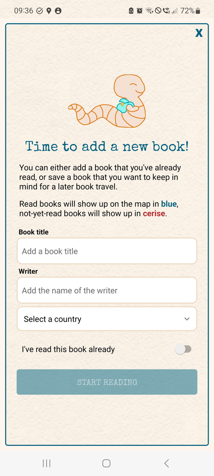
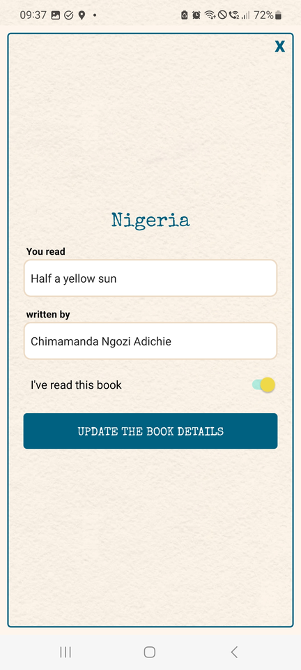
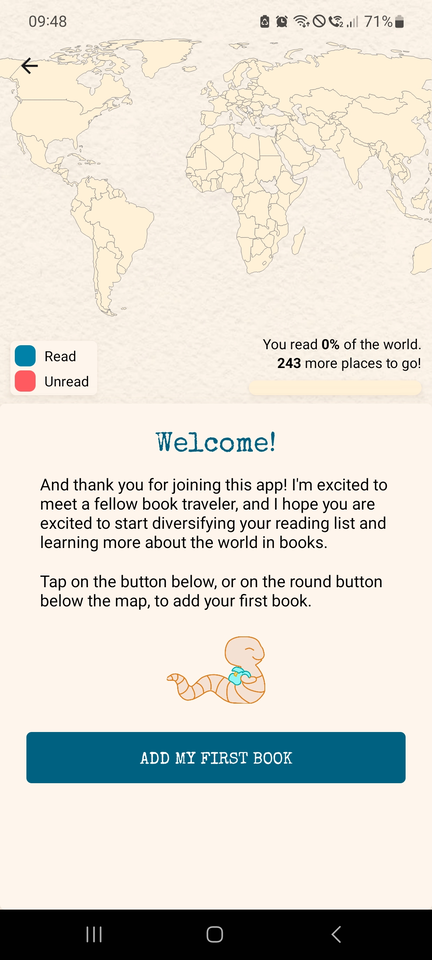
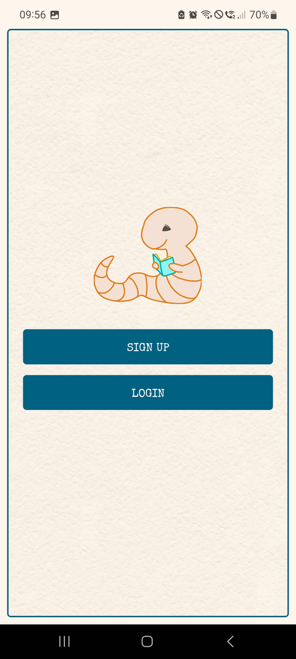

# Book Travels

_Book Travels_ is an app that visualises which geographical areas in the world are included in your reading list.
It was born out of the desire to track my own progress, after setting the goal for myself to read a book by a writer from every country in the world.

<div style="display: flex;">





</div>

## Technologies

The app has a Node.js backend and a React Native frontend.

## How to run the project

To run the backend, go into the BookTravels-backend folder and run the following commands:

```
npm install
npm run start
```

To run the frontend, go into the BookTravels-frontend folder, and run the following command:

```
npm install
```

Then, depending on your platform of choice, run one of the following commands:

```
npm run start
npm run android
npm run ios
```

The app is easily viewable on your mobile device using Expo. In order to do this, you need to download the ExpoGo app on your mobile device, and make sure that you're on the same Wifi network as the computer on which you're running the application. For a full explanation, see the [Expo Docs](https://docs.expo.dev/get-started/expo-go/).
